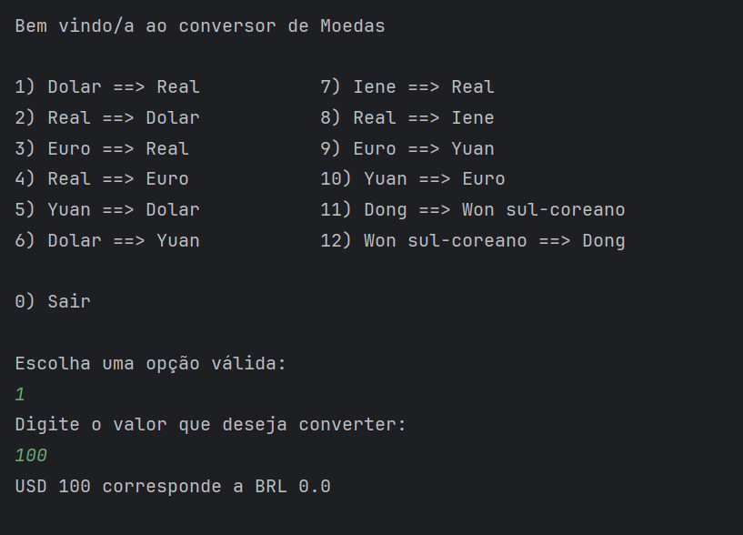

# Conversor de Moedas

## 📖 Sobre o Projeto

Este é um conversor de moedas interativo que funciona via console, desenvolvido como parte de um desafio do programa ONE (Oracle Next Education). A aplicação permite ao usuário escolher entre diversas opções de pares de moedas e obter a taxa de conversão em tempo real, utilizando a API pública [ExchangeRate-API](https://www.exchangerate-api.com/).

## ✨ Funcionalidades

- Conversão entre 6 pares de moedas populares, incluindo Dólar, Real, Euro, Iene, Yuan, Dong e Won.
- Menu interativo no console para uma experiência de usuário simples e direta.
- Utilização de taxas de câmbio atualizadas, fornecidas em tempo real pela ExchangeRate-API.
- Validação de entrada para garantir que o usuário forneça dados válidos.
- Código-fonte organizado em pacotes.

## 🛠️ Tecnologias Utilizadas

- **Java 21**
- **Gson:** Para conversão de objetos Java para JSON e vice-versa.
- **ExchangeRate-API:** Como fonte para as taxas de câmbio.

## 🚀 Como Usar

Para executar este projeto em seu computador, siga os passos abaixo.

### 1. Obtenha sua Chave da API

A aplicação requer uma chave (API Key) para acessar os dados de conversão.

1.  Acesse o site [https://www.exchangerate-api.com/](https://www.exchangerate-api.com/).
2.  Clique em "Get Free Key" e crie uma conta gratuita.
3.  Após o cadastro, você receberá sua chave de API no seu email. Copie essa chave.

### 2. Clone o Repositório

Abra seu terminal ou Git Bash e clone este repositório para sua máquina local:

`https://github.com/Valdir-J/conversor-de-moedas.git`

### 3. Configure a Chave da API no Projeto

1.  Abra o projeto clonado em sua IDE, de preferência o IntelliJ.
2.  Navegue até o arquivo `ExchangeRateApiClient.java` no seguinte caminho:
    `src/com/conversor/service/ExchangeRateApiClient.java`
3.  Encontre a variável `API_KEY` e cole a sua chave.

### 4. Execute o Projeto

Para executar o projeto, clique no botão verde ao lado de um botão verde com o ícone ao lado de um ícone semelhante ao de um besouro.

### Imagens 

Conversor de meodas sendo executado no Intellij, no console.
